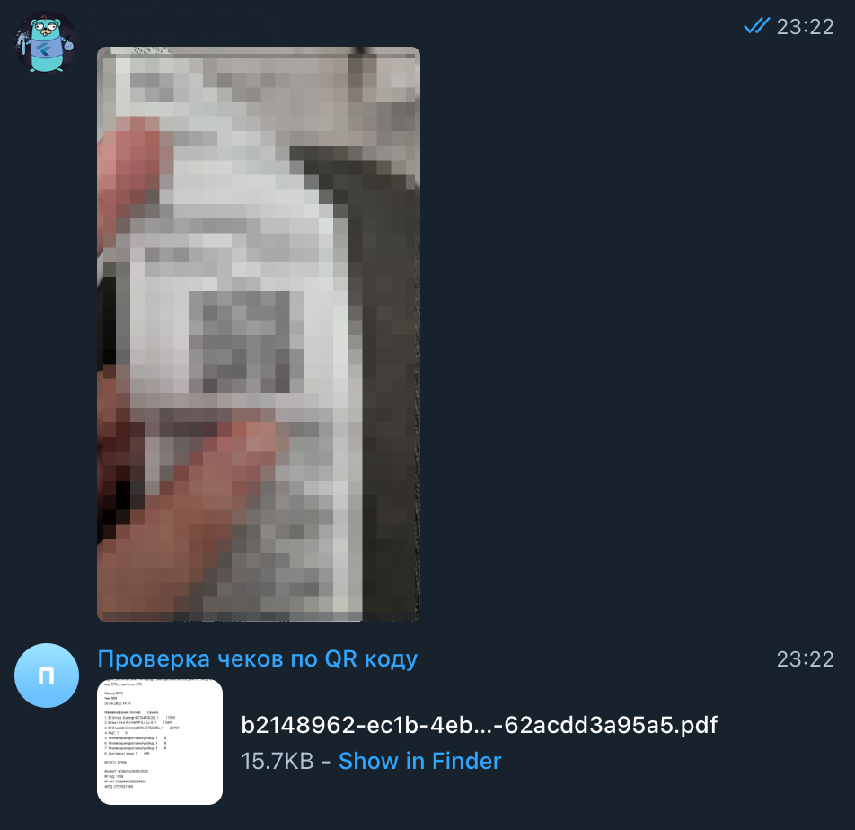

# Telegram бот для получение чеков по QR-коду

## Cтэк:
 - Kotlin
 - Spring Boot
 - Zxing для чтение QR-кодов
 - TelegramBots Java - взаимодействие с API телеграм
 - ITextPdf - генерация PDF файла

## Пример работы:

